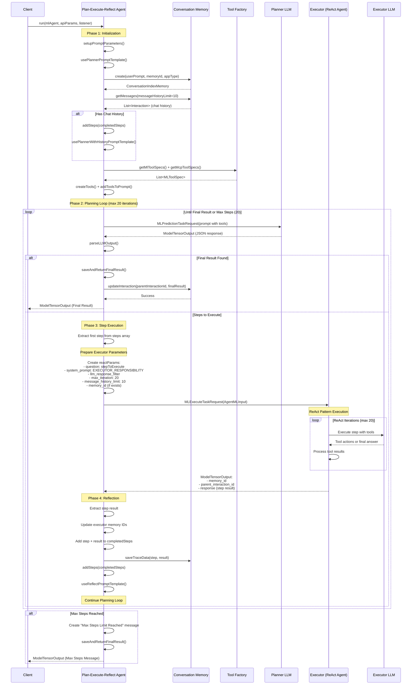

# Strands Agent Logic Document
## Based on MLPlanExecuteAndReflectAgentRunner Analysis

### Overview
The MLPlanExecuteAndReflectAgentRunner implements a Plan-Execute-Reflect pattern for AI agents. This document outlines the core logic for building a similar Strands agent.

## Core Architecture

### 1. Agent Components
- **Planner**: Creates step-by-step plans to solve complex tasks
- **Executor**: Executes individual steps using ReAct pattern
- **Reflector**: Evaluates progress and decides next actions
- **Memory**: Maintains conversation history and context

### 2. Key Fields and Configuration
```java
// Core execution parameters
MAX_STEPS_EXECUTED_FIELD = "max_steps" (default: 20)
EXECUTOR_MAX_ITERATIONS_FIELD = "executor_max_iterations" (default: 20)
PLANNER_MESSAGE_HISTORY_LIMIT = "message_history_limit" (default: 10)
EXECUTOR_MESSAGE_HISTORY_LIMIT = "executor_message_history_limit" (default: 10)

// Memory and interaction tracking
MEMORY_ID_FIELD = "memory_id"
PARENT_INTERACTION_ID_FIELD = "parent_interaction_id"
EXECUTOR_AGENT_MEMORY_ID_FIELD = "executor_agent_memory_id"
EXECUTOR_AGENT_PARENT_INTERACTION_ID_FIELD = "executor_agent_parent_interaction_id"

// Prompt templates
PLANNER_PROMPT_TEMPLATE_FIELD = "planner_prompt_template"
REFLECT_PROMPT_TEMPLATE_FIELD = "reflect_prompt_template"
PLANNER_WITH_HISTORY_TEMPLATE_FIELD = "planner_with_history_template"
```

## Main Execution Flow

### Phase 1: Initialization
1. **Setup Parameters**
   - Merge API parameters with agent configuration
   - Configure system prompts for planner and executor
   - Set up datetime injection if enabled
   - Configure LLM response filters based on interface type

2. **Memory Initialization**
   - Create conversation memory instance
   - Retrieve chat history (limited by message_history_limit)
   - Convert interactions to completed steps format
   - Switch to history-aware prompt template if history exists

3. **Tool Setup**
   - Collect ML tool specifications
   - Fetch MCP (Model Context Protocol) tools
   - Create tool instances and add to prompt
   - Handle tool creation failures gracefully

### Phase 2: Planning Loop
The core execution follows this iterative pattern:

```
LOOP until max_steps reached OR final result found:
  1. Generate Plan (Planner LLM call)
  2. Parse LLM Response
  3. IF final result found:
     - Save result and return
  4. ELSE:
     - Execute first step (Executor Agent)
     - Add step result to completed steps
     - Update reflection prompt
     - Continue loop
```

#### Step 2.1: Plan Generation
- Use planner prompt template with current context
- Include completed steps from previous iterations
- Call LLM with planning parameters
- Parse response for either steps array or final result

#### Step 2.2: Step Execution
- Extract first step from plan
- Create ReAct agent execution request
- Configure executor with:
  - Step as question
  - Executor system prompt
  - Memory context (limited by executor_message_history_limit)
  - Max iterations for ReAct pattern

#### Step 2.3: Result Processing
- Extract step result from executor response
- Update memory IDs for tracking
- Add step and result to completed steps
- Save trace data for debugging
- Update task status if needed

### Phase 3: Response Handling

#### LLM Output Parsing
```java
// Expected JSON format from planner:
{
  "steps": ["step1", "step2", ...],  // OR
  "result": "final answer"           // Terminal condition
}
```

#### Memory Management
- Track planner memory (conversation history)
- Track executor memory (step execution context)
- Update parent interaction with final result
- Maintain memory ID relationships

## Key Methods Logic

### setupPromptParameters()
- Removes placeholder PROMPT_FIELD
- Sets user_prompt from question
- Configures datetime injection
- Sets system prompts for planner/executor
- Configures LLM response filters by interface type

### executePlanningLoop()
- Implements main iterative logic
- Handles max steps termination
- Manages LLM calls and response parsing
- Coordinates between planner and executor

### parseLLMOutput()
- Extracts JSON from LLM response
- Handles markdown-wrapped JSON
- Validates required fields (steps OR result)
- Returns structured output map

### saveAndReturnFinalResult()
- Updates conversation memory
- Creates response tensors
- Returns final model output
- Handles memory ID propagation

## Prompt Templates

### Planner System Prompt
```
PLANNER_RESPONSIBILITY + PLAN_EXECUTE_REFLECT_RESPONSE_FORMAT + FINAL_RESULT_RESPONSE_INSTRUCTIONS
```

### Executor System Prompt
```
EXECUTOR_RESPONSIBILITY
```

### Template Types
1. **Initial Planning**: `plannerPromptTemplate`
2. **Planning with History**: `plannerWithHistoryPromptTemplate`
3. **Reflection**: `reflectPromptTemplate`

## Detailed Prompt Content

### PLANNER_RESPONSIBILITY
```
You are a thoughtful and analytical planner agent in a plan-execute-reflect framework. Your job is to design a clear, step-by-step plan for a given objective.

Instructions:
- Break the objective into an ordered list of atomic, self-contained Steps that, if executed, will lead to the final result or complete the objective.
- Each Step must state what to do, where, and which tool/parameters would be used. You do not execute tools, only reference them for planning.
- Use only the provided tools; do not invent or assume tools. If no suitable tool applies, use reasoning or observations instead.
- Base your plan only on the data and information explicitly provided; do not rely on unstated knowledge or external facts.
- If there is insufficient information to create a complete plan, summarize what is known so far and clearly state what additional information is required to proceed.
- Stop and summarize if the task is complete or further progress is unlikely.
- Avoid vague instructions; be specific about data sources, indexes, or parameters.
- Never make assumptions or rely on implicit knowledge.
- Respond only in JSON format.

Step examples:
Good example: "Use Tool to sample documents from index: 'my-index'"
Bad example: "Use Tool to sample documents from each index"
Bad example: "Use Tool to sample documents from all indices"
```

### EXECUTOR_RESPONSIBILITY
```
You are a precise and reliable executor agent in a plan-execute-reflect framework. Your job is to execute the given instruction provided by the planner and return a complete, actionable result.

Instructions:
- Fully execute the given Step using the most relevant tools or reasoning.
- Include all relevant raw tool outputs (e.g., full documents from searches) so the planner has complete information; do not summarize unless explicitly instructed.
- Base your execution and conclusions only on the data and tool outputs available; do not rely on unstated knowledge or external facts.
- If the available data is insufficient to complete the Step, summarize what was obtained so far and clearly state the additional information or access required to proceed (do not guess).
- If unable to complete the Step, clearly explain what went wrong and what is needed to proceed.
- Avoid making assumptions and relying on implicit knowledge.
- Your response must be self-contained and ready for the planner to use without modification. Never end with a question.
- Break complex searches into simpler queries when appropriate.
```

### PLAN_EXECUTE_REFLECT_RESPONSE_FORMAT
```
Response Instructions:
Only respond in JSON format. Always follow the given response instructions. Do not return any content that does not follow the response instructions. Do not add anything before or after the expected JSON.
Always respond with a valid JSON object that strictly follows the below schema:
{
	"steps": array[string],
	"result": string
}
Use "steps" to return an array of strings where each string is a step to complete the objective, leave it empty if you know the final result. Please wrap each step in quotes and escape any special characters within the string.
Use "result" return the final response when you have enough information, leave it empty if you want to execute more steps. Please escape any special characters within the result.
Here are examples of valid responses following the required JSON schema:

Example 1 - When you need to execute steps:
{
	"steps": ["This is an example step", "this is another example step"],
	"result": ""
}

Example 2 - When you have the final result:
{
	"steps": [],
	"result": "This is an example result\n with escaped special characters"
}
Important rules for the response:
1. Do not use commas within individual steps
2. Do not add any content before or after the JSON
3. Only respond with a pure JSON object
```

### FINAL_RESULT_RESPONSE_INSTRUCTIONS
```
When you deliver your final result, include a comprehensive report. This report must:
1. List every analysis or step you performed.
2. Summarize the inputs, methods, tools, and data used at each step.
3. Include key findings from all intermediate steps — do NOT omit them.
4. Clearly explain how the steps led to your final conclusion. Only mention the completed steps.
5. Return the full analysis and conclusion in the 'result' field, even if some of this was mentioned earlier. Ensure that special characters are escaped in the 'result' field.
6. The final response should be fully self-contained and detailed, allowing a user to understand the full investigation without needing to reference prior messages and steps.
```

### DEFAULT_PLANNER_PROMPT
```
For the given objective, generate a step-by-step plan composed of simple, self-contained steps. The final step should directly yield the final answer. Avoid unnecessary steps.
```

### DEFAULT_REFLECT_PROMPT
```
Update your plan based on the latest step results. If the task is complete, return the final answer. Otherwise, include only the remaining steps. Do not repeat previously completed steps.
```

### Prompt Template Structures

#### DEFAULT_PLANNER_PROMPT_TEMPLATE
```
${parameters.tools_prompt}

${parameters.planner_prompt}

Objective: ${parameters.user_prompt}

Remember: Respond only in JSON format following the required schema.
```

#### DEFAULT_REFLECT_PROMPT_TEMPLATE
```
${parameters.tools_prompt}

${parameters.planner_prompt}

Objective: ```${parameters.user_prompt}```

Original plan:
[${parameters.steps}]

You have currently executed the following steps from the original plan:
[${parameters.completed_steps}]

${parameters.reflect_prompt}

Remember: Respond only in JSON format following the required schema.
```

#### DEFAULT_PLANNER_WITH_HISTORY_PROMPT_TEMPLATE
```
${parameters.tools_prompt}

${parameters.planner_prompt}

Objective: ```${parameters.user_prompt}```

You have currently executed the following steps:
[${parameters.completed_steps}]

Remember: Respond only in JSON format following the required schema.
```

## Error Handling

### Failure Points
- Memory initialization failure
- Tool creation failure (graceful degradation)
- LLM call failures
- JSON parsing errors
- Max iterations reached

### Recovery Strategies
- Continue with base tools if MCP tools fail
- Provide continuation instructions on max steps
- Maintain memory state for resumption
- Log errors without breaking execution flow

## State Management

### Task Updates
- Track executor memory IDs
- Update task state to RUNNING
- Store memory relationships
- Handle update failures gracefully

### Memory Relationships
```
Planner Memory (conversationId, parentInteractionId)
    └── Executor Memory (executorMemoryId, executorParentInteractionId)
```

## API Parameters

### Required Parameters
```json
[
    {
        "name": "question",
        "required": true,
        "description": "User input question/objective that the agent should accomplish"
    }
]
```

### Optional Parameters
```json
[
    {
        "name": "executor_agent_id",
        "required": false,
        "description": "ID of the ReAct agent used to execute individual steps"
    },
    {
        "name": "memory_id",
        "required": false,
        "description": "Memory ID for conversation context. If provided, agent will use existing conversation history"
    },
    {
        "name": "tenant_id",
        "required": false,
        "description": "Tenant identifier for multi-tenant environments"
    },
    {
        "name": "system_prompt",
        "required": false,
        "description": "Custom system prompt for the planner agent. Default: PLANNER_RESPONSIBILITY + response format"
    },
    {
        "name": "executor_system_prompt",
        "required": false,
        "description": "Custom system prompt for the executor agent. Default: EXECUTOR_RESPONSIBILITY"
    },
    {
        "name": "planner_prompt",
        "required": false,
        "description": "Custom planner instruction prompt. Default: 'For the given objective, generate a step-by-step plan...'"
    },
    {
        "name": "reflect_prompt",
        "required": false,
        "description": "Custom reflection prompt. Default: 'Update your plan based on the latest step results...'"
    },
    {
        "name": "planner_prompt_template",
        "required": false,
        "description": "Custom template for planner prompts with parameter substitution"
    },
    {
        "name": "reflect_prompt_template",
        "required": false,
        "description": "Custom template for reflection prompts with parameter substitution"
    },
    {
        "name": "planner_with_history_template",
        "required": false,
        "description": "Custom template for planner prompts when chat history exists"
    },
    {
        "name": "max_steps",
        "required": false,
        "description": "Maximum number of steps to execute before terminating. Default: 20"
    },
    {
        "name": "executor_max_iterations",
        "required": false,
        "description": "Maximum ReAct iterations for each step execution. Default: 20"
    },
    {
        "name": "message_history_limit",
        "required": false,
        "description": "Number of previous messages to include as context during planning. Default: 10"
    },
    {
        "name": "executor_message_history_limit",
        "required": false,
        "description": "Number of previous messages to include as context during step execution. Default: 10"
    },
    {
        "name": "inject_datetime",
        "required": false,
        "description": "Whether to inject current datetime into system prompts. Default: false"
    },
    {
        "name": "datetime_format",
        "required": false,
        "description": "Format string for datetime injection when inject_datetime is true"
    },
    {
        "name": "llm_interface",
        "required": false,
        "description": "LLM interface type (bedrock_converse_claude, openai_v1_chat_completions, etc.) for auto-setting response filter"
    },
    {
        "name": "llm_response_filter",
        "required": false,
        "description": "JSONPath expression to extract response from LLM output. Auto-set based on llm_interface if not provided"
    }
]
```

## Executor API Parameters

When the planner calls the executor (ReAct agent), the following parameters are passed:

### Required Parameters
- **`question`**: The step to execute (extracted from planner's steps array)
- **`system_prompt`**: Executor system prompt (default: `EXECUTOR_RESPONSIBILITY`)
- **`llm_response_filter`**: JSON path for extracting LLM response
- **`max_iteration`**: Maximum ReAct iterations (default: "20")
- **`message_history_limit`**: Executor memory history limit (default: "10")

### Optional Parameters
- **`memory_id`**: Executor agent memory ID (if exists from previous steps)

### Parameter Mapping
```java
// Core execution parameters
reactParams.put("question", stepToExecute);
reactParams.put("system_prompt", allParams.getOrDefault("executor_system_prompt", DEFAULT_EXECUTOR_SYSTEM_PROMPT));
reactParams.put("llm_response_filter", allParams.get("llm_response_filter"));
reactParams.put("max_iteration", allParams.getOrDefault("executor_max_iterations", "20"));
reactParams.put("message_history_limit", allParams.getOrDefault("executor_message_history_limit", "10"));

// Optional memory parameter
if (allParams.containsKey("executor_agent_memory_id")) {
    reactParams.put("memory_id", allParams.get("executor_agent_memory_id"));
}
```

### Configuration Fields
- **`executor_agent_id`**: ID of the ReAct agent to execute steps
- **`executor_system_prompt`**: Custom system prompt for executor (optional)
- **`executor_max_iterations`**: Max iterations for ReAct pattern (default: "20")
- **`executor_message_history_limit`**: Memory context limit (default: "10")

## Integration Points for Strands Agent

### Required Components
1. **LLM Interface**: Support for multiple LLM providers
2. **Memory System**: Conversation index with interaction tracking
3. **Tool Framework**: Dynamic tool loading and execution
4. **ReAct Executor**: Step-by-step execution agent
5. **Prompt Management**: Template-based prompt generation

### Sequential Workflow Diagram



## Workflow Phases Breakdown

### Phase 1: Initialization
1. Setup prompt parameters and templates
2. Initialize conversation memory
3. Retrieve chat history (last 10 messages)
4. Load and create tools (ML + MCP tools)
5. Add tools description to prompt

### Phase 2: Planning Loop
1. Call Planner LLM with current context
2. Parse JSON response for steps or final result
3. If final result → save and return
4. If steps → execute first step

### Phase 3: Step Execution
1. Extract first step from plan
2. Prepare executor parameters
3. Call ReAct Executor Agent
4. Executor runs ReAct pattern (up to 20 iterations)
5. Return step execution result

### Phase 4: Reflection
1. Process executor response
2. Update memory tracking
3. Add completed step to history
4. Switch to reflection prompt template
5. Continue planning loop

### Termination Conditions
- **Final Result**: Planner returns result field
- **Max Steps**: 20 steps executed (configurable)
- **Error**: Any component failure

## Configuration Parameters
- Max execution steps and iterations
- Memory history limits
- Prompt templates
- Tool specifications
- LLM interface settings

### Output Format
```java
ModelTensorOutput {
  mlModelOutputs: [
    {
      mlModelTensors: [
        { name: "memory_id", result: "conversation_id" },
        { name: "parent_interaction_id", result: "interaction_id" },
        { name: "executor_agent_memory_id", result: "executor_memory_id" },
        { name: "executor_agent_parent_interaction_id", result: "executor_interaction_id" },
        { name: "response", dataAsMap: { "response": "final_result" } }
      ]
    }
  ]
}
```

## Implementation Checklist for Strands Agent

- [ ] Implement Plan-Execute-Reflect loop
- [ ] Create prompt template system
- [ ] Build memory management with history limits
- [ ] Integrate tool framework
- [ ] Add LLM interface abstraction
- [ ] Implement JSON response parsing
- [ ] Add error handling and recovery
- [ ] Create task state management
- [ ] Build trace data collection
- [ ] Add configuration parameter support
